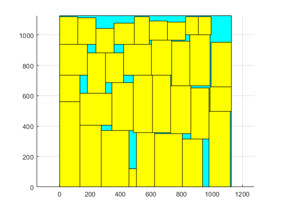
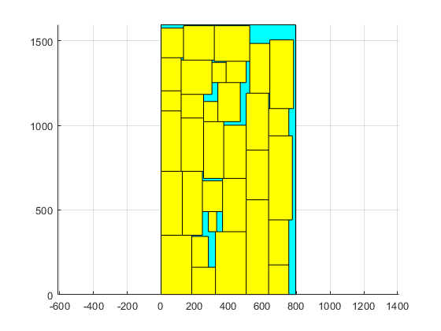
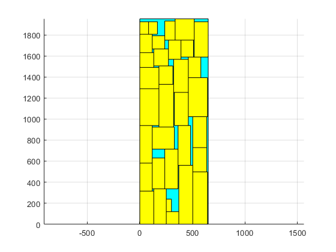

# Physical_Design
N25K200 2023 NCKU-PHYSICAL DESIGN for NANOMETER IC's Projects

## Project1 : Fiduccia–Mattheyses algorithm (Partition)

**Goal : Minimize the cut‐size between two partitions.**
| Benchmark   | Pin num | Initial Cut_size | Final Cut_size | RunTime(s) |
|:-----------:|:-------:|:----------------:|:--------------:|:----------:|
| adaptec1    |  944053 |           15157  |         10384  |      1.03  |
| adaptec2    | 1069482 |           23409  |         17088  |      1.23  |
| adaptec3    | 1875039 |          102851  |         61558  |      2.63  |
| superblue1  | 2861188 |          212136  |         65971  |     29.36  |
| superblue2  | 3228345 |          267205  |        196989  |     14.56  |


---  


## Project2 : Simulated Annealing Algorithm (Placement)

**Goal: Randomly perturb object for placement.**

*Benchmark ami33*

ami33_1_10:   
  >aspect_ratio = 1   
  >White space: 10%
  


ami33_2_10:   
  >aspect_ratio = 1   
  >White space: 10%
  


ami33_3_10:   
  >aspect_ratio = 1   
  >White space: 10%
  


---  


## Project3 : Improving Wirelength based on Abacus (Detail-Placement)

**Goal: Improve Wirelength in 5 minute.**  

```text
Phase 1: .nodes file  
         Total Nodes             : 847441  
         Movable Nodes           : 765102  
         Terminal Nodes          : 82339  
         Fixed Terminal Nodes    : 52627  
         Fixed_NI Terminal Nodes : 29712  
Phase 2: .shapes file  
         Total Non-Rectangular Nodes  : 37  
Phase 3: .pl file  
         Total Nodes  : 847441  
Phase 4: .scl file  
         NumRows   : 1829  
         RowHeight : 9  
         Image     : (18, 18) - (22482, 16479)  
Phase 5: solution .pl (LG_E24096205_superblue1.pl) file  
         Total Nodes  : 847441  
-----------------------------------------------------  
Phase 6: Check Legality  
         ERROR_TYPE 0: 0  
         ERROR_TYPE 1: 0  
         ERROR_TYPE 2: 0  
         ERROR_TYPE 3: 0  
         ERROR_TYPE 4: 0  
         Placement is legal  
-----------------------------------------------------  
```

---  


## Project3 : Improving Wirelength based on Abacus (Detail-Placement)

**Goal: Improve Wirelength in 5 minute.**  
