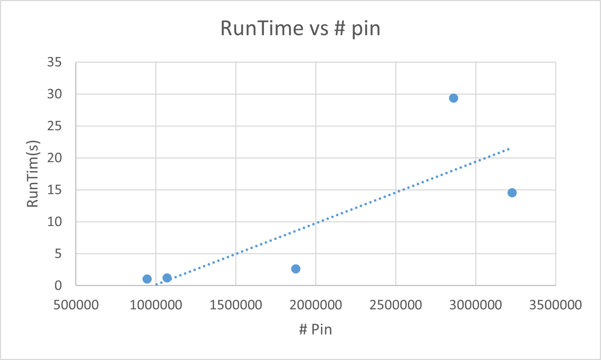

# Physical_Design
N25K200 2023 NCKU-PHYSICAL DESIGN for NANOMETER IC's Projects

## Project1 : Fiduccia–Mattheyses algorithm (Partition)

**Goal : Minimum two groups of cut‐size**
| Benchmark   | Pin num | Initial Cut_size | Final Cut_size | RunTime(s) |
|:-----------:|:-------:|:----------------:|:--------------:|:----------:|
| adaptec1    |  944053 |           15157  |         10384  |      1.03  |
| adaptec2    | 1069482 |           23409  |         17088  |      1.23  |
| adaptec3    | 1875039 |          102851  |         61558  |      2.63  |
| superblue1  | 2861188 |          212136  |         65971  |     29.36  |
| superblue2  | 3228345 |          267205  |        196989  |     14.56  |

